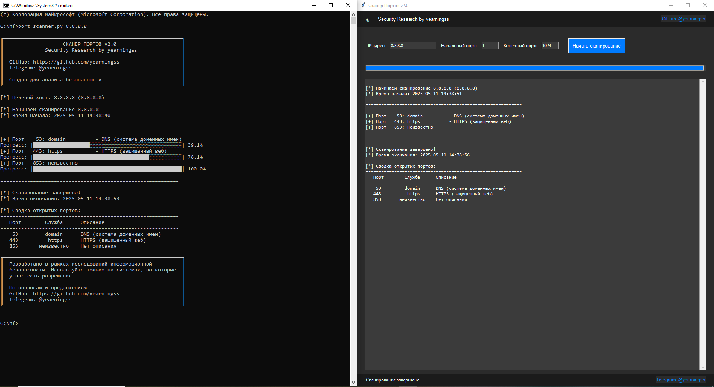

# 🛡️ Port Scanner v2.0

Продвинутый сканер портов с графическим интерфейсом и консольной версией. Разработан для исследования безопасности сетевых систем.



## ✨ Возможности

- 🖥️ Графический интерфейс в современном дизайне
- 📊 Консольная версия с ASCII-интерфейсом
- 🚀 Многопоточное сканирование для высокой скорости
- 🔍 Определение служб на открытых портах
- 📝 Подробное описание популярных портов
- 🌐 Поддержка доменных имен и IP-адресов
- ⏱️ Отображение прогресса и времени сканирования
- 📋 Удобное копирование и вставка текста

## 🚀 Установка

1. Клонируйте репозиторий:
```bash
git clone https://github.com/yearningss/port-scanner.git
cd port-scanner
```

2. Убедитесь, что у вас установлен Python 3.x
3. Никаких дополнительных зависимостей не требуется!

## 💻 Использование

### Графическая версия

```bash
python port_scanner_gui.py
```

### Консольная версия

Базовое использование:
```bash
python port_scanner.py target_ip
```

Пример:
```bash
python port_scanner.py 192.168.1.1
```

### Дополнительные параметры

- `-s` или `--start`: Начальный порт (по умолчанию: 1)
- `-e` или `--end`: Конечный порт (по умолчанию: 1024)
- `-t` или `--threads`: Количество потоков (по умолчанию: 100)

Пример с параметрами:
```bash
python port_scanner.py 192.168.1.1 -s 20 -e 100 -t 50
```

## 📋 Описание популярных портов

| Порт | Служба | Описание |
|------|---------|-----------|
| 20 | FTP | Передача данных |
| 21 | FTP | Управление |
| 22 | SSH | Безопасный удаленный доступ |
| 23 | Telnet | Небезопасный удаленный доступ |
| 25 | SMTP | Электронная почта |
| 53 | DNS | Система доменных имен |
| 80 | HTTP | Веб-сайты |
| 110 | POP3 | Получение почты |
| 143 | IMAP | Доступ к почте |
| 443 | HTTPS | Защищенный веб |
| 445 | SMB | Общий доступ к файлам Windows |
| 3306 | MySQL | База данных |
| 3389 | RDP | Удаленный рабочий стол Windows |
| 5432 | PostgreSQL | База данных |
| 8080 | HTTP | Веб-прокси |
| 8443 | HTTPS | Альтернативный порт |

## 🔒 Безопасность

⚠️ Важно: Используйте этот инструмент только для тестирования систем, на которые у вас есть разрешение. Несанкционированное сканирование портов может быть незаконным.

## 🛠️ Разработка

Проект разработан с использованием:
- Python 3.x
- tkinter для GUI
- Встроенные модули Python (socket, threading, etc.)

## 📝 Лицензия

MIT License. См. файл [LICENSE](LICENSE) для подробностей.

## 👤 Автор

**yearningss**

- GitHub: [@yearningss](https://github.com/yearningss)
- Telegram: [@yearningss](https://t.me/yearningss)

## 🤝 Участие в проекте

Вклады, проблемы и запросы на новые функции приветствуются!
Не стесняйтесь проверять [страницу issues](https://github.com/yearningss/port-scanner/issues). 